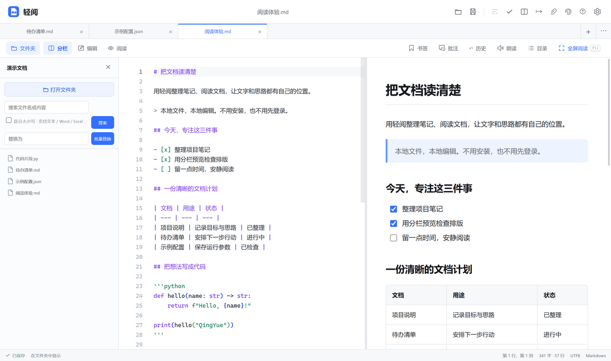
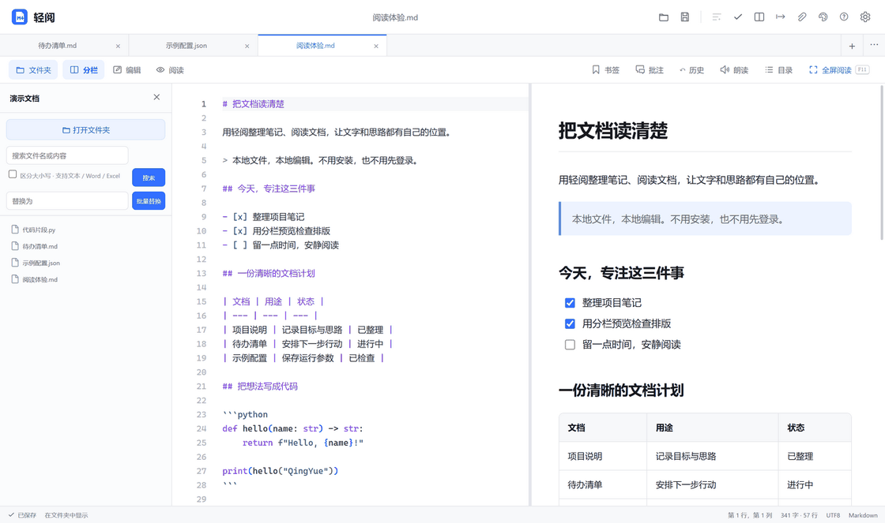
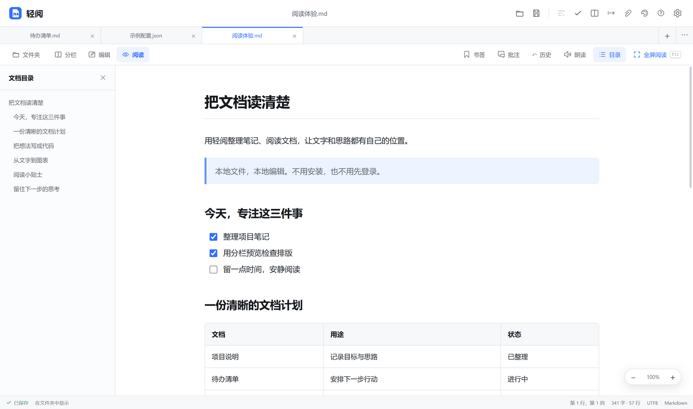
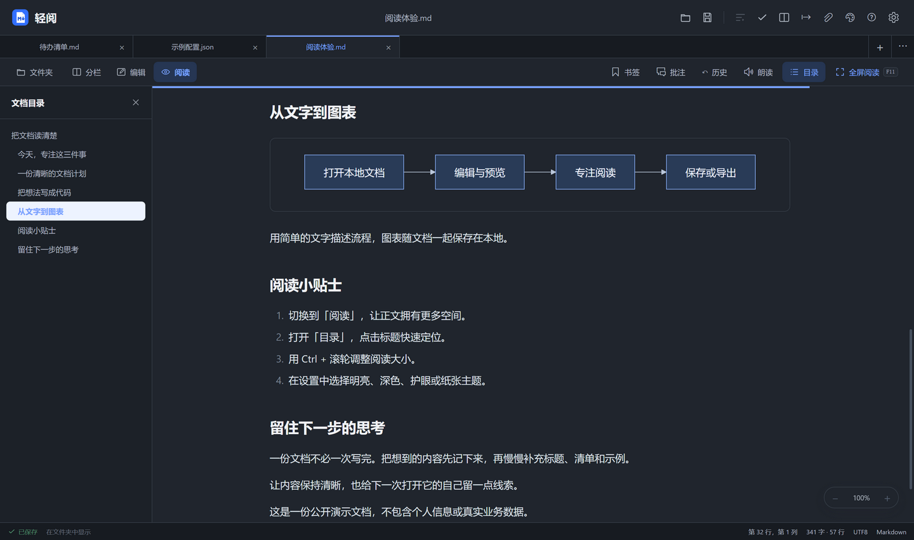
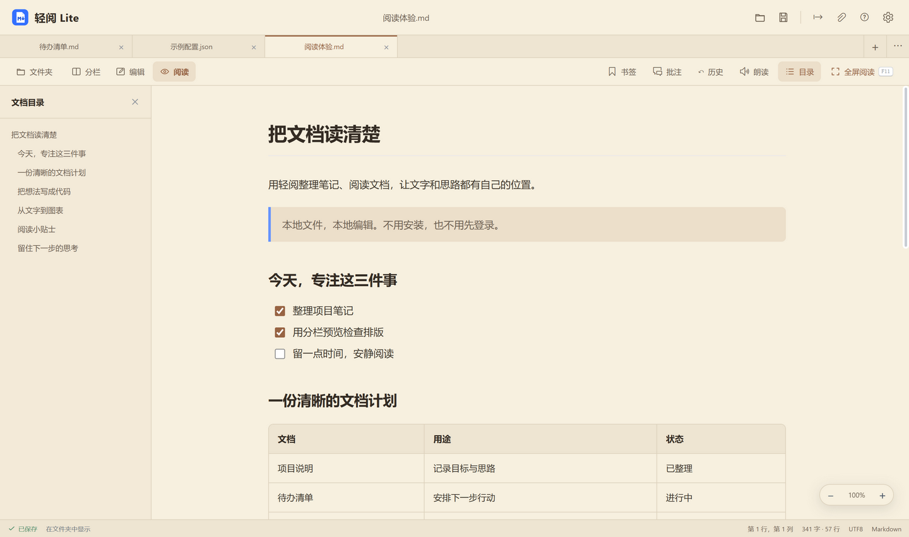

# QingYue · 轻阅

**A comfortable place for your local documents.**

A portable, offline Markdown and text reader/editor for Windows. Write with a live split-pane preview, then hide the editor when you want to focus on reading. No installation or account is required. Full and Lite editions are available.

[简体中文](README.md) · [Download](#download) · [Demo](#see-it-in-action) · [Report an issue](https://github.com/HeYun0576/qingyue/issues)

**The application interface is currently in Chinese.** This page provides English documentation, not an English UI option.



*Actual released application UI with public demo files. Click any screenshot for the full-size image.*

## Download

Windows x64 portable packages:

| Edition | Fast portable ZIP — recommended | Single-file portable EXE |
| --- | --- | --- |
| Full 1.3.3 | [Download ZIP](https://github.com/HeYun0576/qingyue/releases/download/v1.3.3/QingYue-1.3.3-Fast-Portable-x64.zip) | [Download EXE](https://github.com/HeYun0576/qingyue/releases/download/v1.3.3/QingYue-Markdown-1.3.3-Portable-x64.exe) |
| Lite 0.1.1 | [Download ZIP](https://github.com/HeYun0576/qingyue/releases/download/lite-v0.1.1/QingYue-Lite-0.1.1-Fast-Portable-x64.zip) | [Download EXE](https://github.com/HeYun0576/qingyue/releases/download/lite-v0.1.1/QingYue-Lite-0.1.1-Portable-x64.exe) |

Extract the ZIP to a permanent folder and run `QingYue.exe` or `QingYueLite.exe`. ZIP packages avoid the single-file EXE's extraction step on each cold launch. Both formats are portable, not installers.

[All releases](https://github.com/HeYun0576/qingyue/releases) · [SHA-256 checksums](releases/SHA256SUMS.txt) · [Archive notes](releases/README.md)

## See it in action

Split-pane writing → reading mode → outline navigation → zoom → dark theme.



*Recorded from the released UI; pauses are adjusted for readability. This is not a launch-speed benchmark. [Static screenshots and provenance](docs/media/README.md) are also available.*

### Read without the editor getting in the way

An independent left outline helps you navigate long documents without covering the text. Reading controls include zoom, page navigation, bookmarks, annotations, and speech using installed Windows voices.



### Make reading comfortable

Choose light, dark, eye-comfort, paper, or system-following themes. Adjust reading font size and line width. Markdown supports tables, task lists, syntax-highlighted code, math, and Mermaid diagrams.



<details>
<summary>Lite 0.1.1 in the paper reading theme</summary>



</details>

## Full or Lite?

| Capability | Full 1.3.3 | Lite 0.1.1 |
| --- | --- | --- |
| Markdown, text, JSON/YAML and source-file editing | Yes | Yes |
| Tabs, folder search, outline, themes, bookmarks and annotations | Yes | Yes |
| Math and Mermaid preview | Yes | Yes |
| PDF, HTML, Markdown, TXT and RTF export | Yes | Yes |
| Lightweight DOCX/XLSX editing and DOCX export | Yes | No |
| Whiteboard, mind-map editor, image tools, comparison and validation | Yes | No |
| Editor | Monaco with IDE language services | Simplified text editor |

Try Lite if you mainly read and write. Choose Full if you need its additional document tools. Lite removes heavy features and dependencies but **still bundles Electron**; it is not a tiny native application.

## Everyday workflow

- Open a file from the app, drag it into the window, or choose QingYue through Windows “Open with”.
- Switch between editing, split-pane, and reading layouts. Use `F11` for fullscreen reading.
- Zoom with `Ctrl` + mouse wheel. In reading mode, Left/Right and PageUp/PageDown turn pages; Up/Down scroll normally.
- Keep several documents in tabs. Choose an empty launch, a blank document, or restoration of previous tabs.
- Use folder search, document history, bookmarks, annotations, and exports without a cloud account.

Full edition data lives beside the application in `QingYue-Data`; Lite uses `QingYueLite-Data`. If you move the application after registering file associations, remove and register them again from settings. Registration does not force Windows default-app choices or take over executable scripts such as BAT/CMD.

## Scope and limitations

- The published packages target **Windows x64**. No macOS or Linux binaries are provided.
- DOCX editing focuses on readable content, not exact reproduction of complex Word layouts. XLSX lightweight editing covers the first 500 rows and 100 columns. Formulas are recalculated by full spreadsheet software, and macros are not executed. Keep originals; the first Office save creates a copy.
- Lite text files are limited to 32 MB; preview is disabled above 8 MB. Full edition can open text up to 256 MB after confirmation in large-file mode. Large files do not retain every normal editing/preview feature.
- Speech voices come from Windows. Availability and voice quality depend on installed voices; no bundled neural TTS engine is claimed.
- Documents are processed locally. Remote images/audio referenced in a document and external links can still access the network and may be unavailable offline.
- Historical versions 1.0.0–1.3.2 are original **binary archives only**. Their `archive-v*` tags contain an archive catalog, not original source snapshots. `v1.3.3` and `lite-v0.1.1` point to the actual shared source.

## Development

With Node.js and pnpm available:

```powershell
pnpm install
pnpm dev:app
```

Check and build the Full portable EXE:

```powershell
pnpm dist:portable
```

Build Lite:

```powershell
pnpm build:lite
pnpm stage:lite
pnpm exec electron-builder --projectDir release/lite-stage --win portable --x64 --publish never
```

ZIP releases are archives of the corresponding packaged application directories. See the [Chinese documentation](README.md) for the full feature list and more detailed notes.

## Contribute

QingYue is released under the [MIT License](LICENSE). Issues, suggestions, and pull requests are welcome. If it is useful to you, a Star helps you find the project again and lets us know it is helping.
